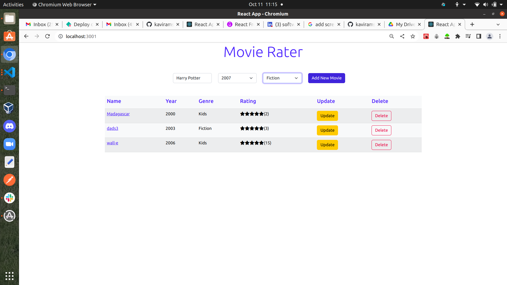
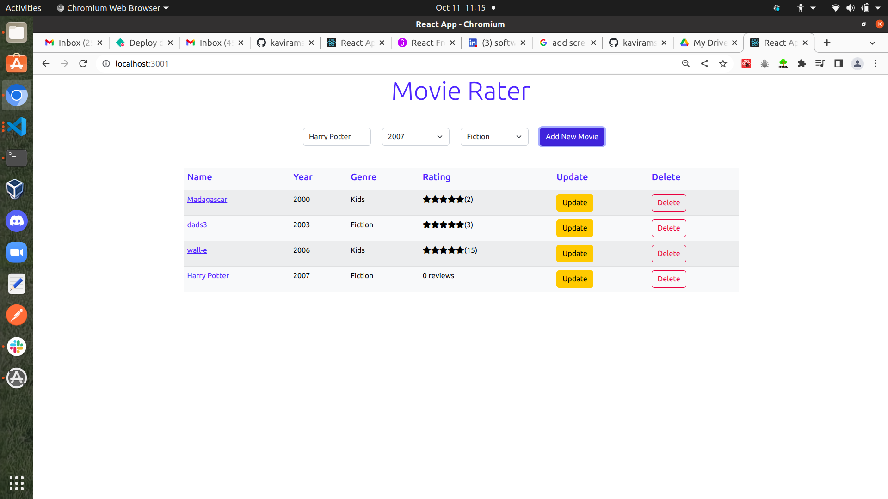
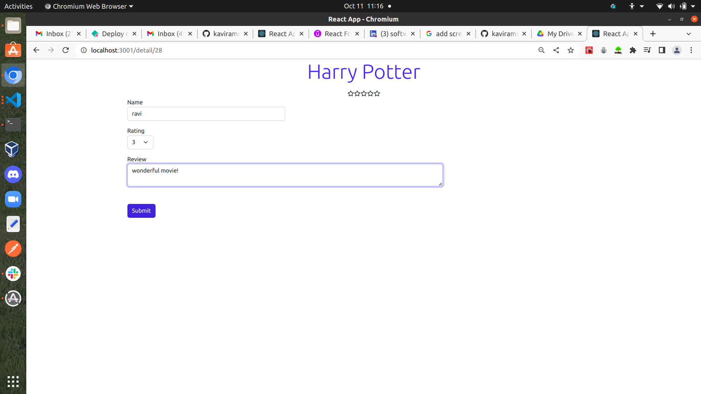
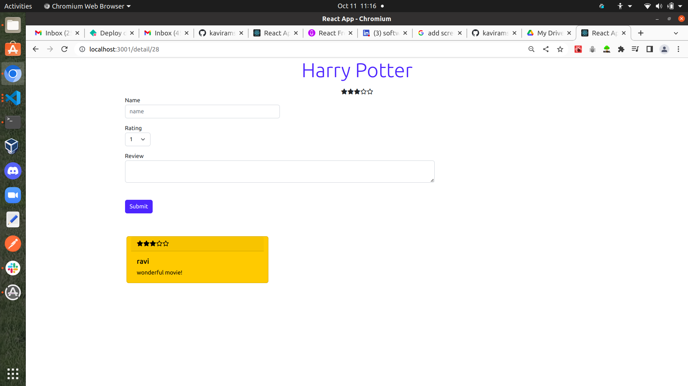
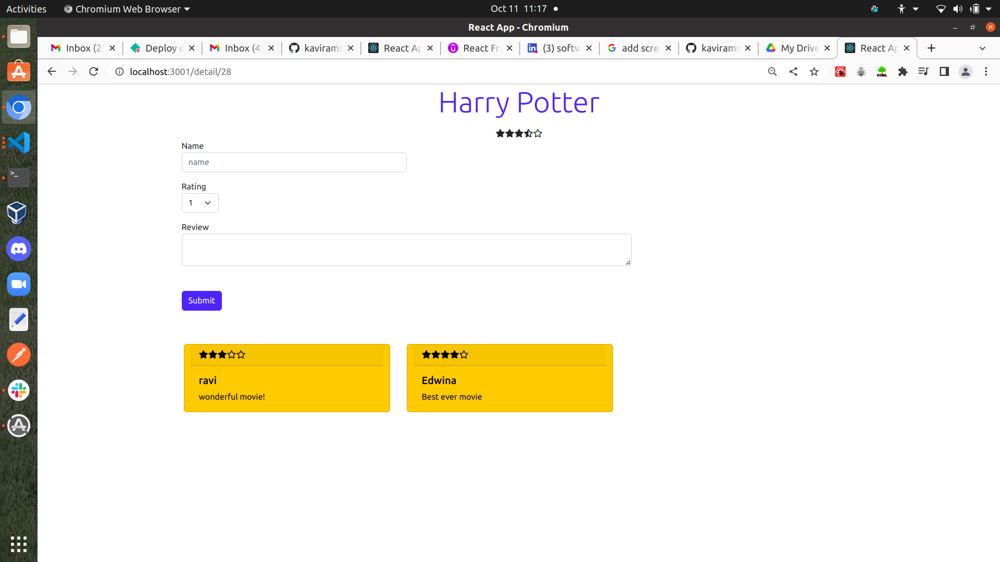

# Movie-Rater
This is a PERN Stack app that displays a list of movies and their corrsponding ratings.

The app lets user add a new movie,edit a movie ,delete a movie if there are no associated reviews and also add revivews to a particular movie.

There app uses Postgres database which serves data to a Rest API which is accessed/modified by a react front end.

## Screen Shots

## Tech Stack 

* ReactJS

* NodeJS/ExpressJS

* PostgreSQL
